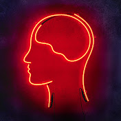
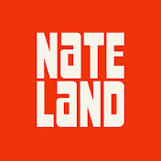
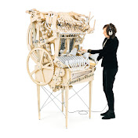

The YouTube channels I follow and recommend.

## Theology

<a class="channel-card" href="https://www.youtube.com/@TruthUnites">Gavin Ortlund (Truth Unites)Thoughtful historical theology and apologetics aimed at gospel assurance.Visit channel →</a>

<a class="channel-card" href="https://www.youtube.com/@wardonwords">Ward on WordsWhere Nerdy & Theology meet.Visit channel →</a>

<a class="channel-card" href="https://www.youtube.com/@reformedfringe">Reformed FringeFringing the Reformed and Reforming the Fringe.Visit channel →</a>

<a class="channel-card" href="https://www.youtube.com/@BobTheBaptistTV">Bob The BaptistReformed Baptist takes on online controversies, doctrine, and politics.Visit channel →</a>

## Educational

<a class="channel-card" href="https://www.youtube.com/@smartereveryday">SmarterEveryDayDestin explores the world through science, & is overall just a pleasant guy to listen to.Visit channel →</a>

<a class="channel-card" href="https://www.youtube.com/@veritasium">VeritasiumScience, education, and anything else with an element of truth.Visit channel →</a>

<a class="channel-card" href="https://www.youtube.com/@MarkRober">Mark RoberGlitter bombs, squirrel mazes, & overall shenanigans.Visit channel →</a>

## Fun

<a class="channel-card" href="https://www.youtube.com/@Nateland">Nateland EntertainmentNate Bargatze's good, clean, funny comedy.Visit channel →</a>

<a class="channel-card" href="https://www.youtube.com/@Wintergatan">WintergatanMusic and engineering — and the occasional gloriously stupid idea.Visit channel →</a>
